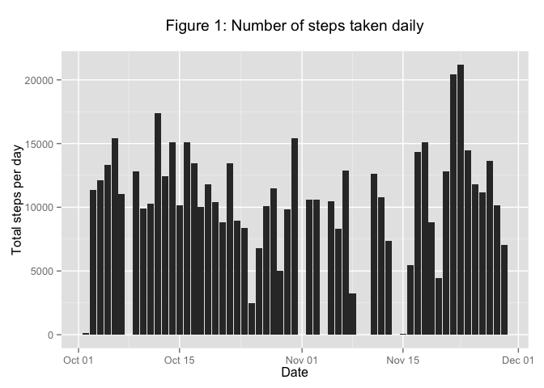
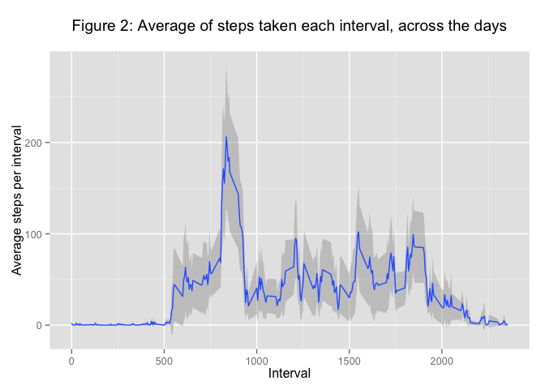
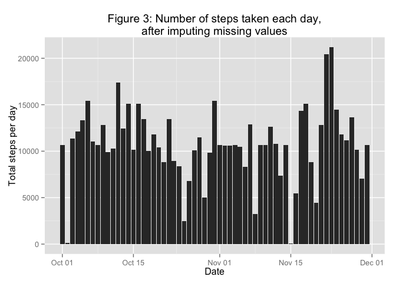
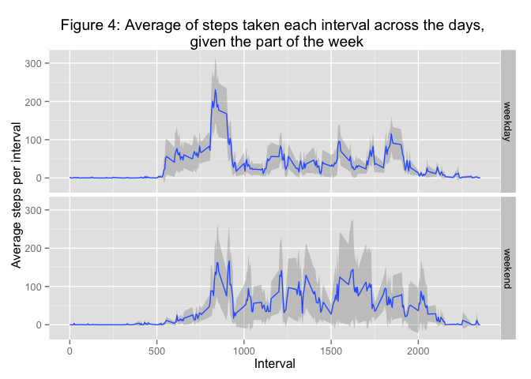

# Reproducible Research: Peer Assessment 1

## Loading and preprocessing the data
The below steps require that the ggplot2 library is installed and loaded.


```r
# Load the plotting package `ggplot2`
# Try to install the package if it is not found.
if(!suppressMessages(require(ggplot2))){
    install.packages('ggplot2')
    if(!suppressMessagesrequire(ggplot2)){
        stop("could not install ggplot2")
    }
}

# Define some options for knitr
knitr::opts_chunk$set(tidy=FALSE, fig.path='figures/')

# Load provided data (use relative paths)
data <- read.csv(file = './activity.csv', stringsAsFactors = FALSE)

# Change class for the date variable
data$date <- as.Date(data$date)
```
### Examining the data
The data for this assignment can be downloaded from the course web site:  
* Dataset: Activity monitoring data [52K]
  
The variables included in this dataset are:  
* steps: Number of steps taking in a 5-minute interval (missing values are coded as NA)  
* date: The date on which the measurement was taken in YYYY-MM-DD format  
* interval: Identifier for the 5-minute interval in which measurement was taken  
The dataset is stored in a comma-separated-value (CSV) file and there are a total of 17,568 observations in this dataset.  
  

```r
summary(data)
```

```
##      steps            date               interval   
##  Min.   :  0.0   Min.   :2012-10-01   Min.   :   0  
##  1st Qu.:  0.0   1st Qu.:2012-10-16   1st Qu.: 589  
##  Median :  0.0   Median :2012-10-31   Median :1178  
##  Mean   : 37.4   Mean   :2012-10-31   Mean   :1178  
##  3rd Qu.: 12.0   3rd Qu.:2012-11-15   3rd Qu.:1766  
##  Max.   :806.0   Max.   :2012-11-30   Max.   :2355  
##  NA's   :2304
```

```r
head(data)
```

```
##   steps       date interval
## 1    NA 2012-10-01        0
## 2    NA 2012-10-01        5
## 3    NA 2012-10-01       10
## 4    NA 2012-10-01       15
## 5    NA 2012-10-01       20
## 6    NA 2012-10-01       25
```

## What is mean total number of steps taken per day?  
1.  Make a histogram of the total number of steps taken each day  


```r
# Summarize the data by day
activity <- aggregate(formula = steps~date, data = data,FUN = sum, na.rm=TRUE)

# Calculate summary statistics
mean_steps <- round(mean(activity$steps), 2)  # Mean
median_steps <- quantile(x = activity$steps, probs = 0.5)  # Median, 50%Q

# Plot the total number of steps per day.
# Use ggplot2 to summarize de data, to
# find inconsistencies with the analysis.
histogram <- 
qplot(x=date, y=steps,
      data=subset(data, complete.cases(data)),
      stat='summary', fun.y=sum, geom='bar') +
  labs(title='Figure 1: Number of steps taken daily\n',
       y='Total steps per day', x='Date')
plot(histogram)
```

 
2.  Calculate and report the mean and median total number of steps taken per day  
Mean: 

```r
  mean_steps
```

```
## [1] 10766
```
  
Median:

```r
  median_steps
```

```
##   50% 
## 10765
```
  
## What is the average daily activity pattern?
Aggregate steps per interval, with mean across the days  

1.  Make a time series plot (i.e. type = "l") of the 5-minute interval (x-axis) and the average number of steps taken, averaged across all days (y-axis)

2.  Which 5-minute interval, on average across all the days in the dataset, contains the maximum number of steps?  

**Figure 2** below shows the average number of steps taken during each interval, across the days (blue line)   

```r
interval <- aggregate(formula=steps~interval, data=data, FUN=mean, na.rm=TRUE)
# Get the data for the interval with the most average activity across the days
max_steps <- interval[which(interval$steps==max(interval$steps)),]

# Function to calculate de mean and normal 
mean_ci <- function(data){
    m <- mean(data)
    data.frame(y=m,
               ymin = m-(1.96*sd(data)/sqrt(length(data))),
               ymax = m+(1.96*sd(data)/sqrt(length(data))))
}

# Plot the average number of steps per interval.
# Use ggplot2 to summarize de data, to find inconsistencies with the analysis.
steps_per_interval <- 
qplot(x=interval, y=steps,
      data=subset(data, complete.cases(data)),
      geom='smooth', stat='summary', fun.data=mean_ci) +
  labs(title='Figure 2: Average of steps taken each interval, across the days\n',
       y='Average steps per interval', x='Interval')

steps_per_interval
```

 

## Imputing missing values
Note that there are a number of days/intervals where there are missing values (coded as NA). The presence of missing days may introduce bias into some calculations or summaries of the data.  

The provided data contains a total of 2304, from which 2304 are missing number of steps, and none are missing dates or interval labels (i.e. all missing values are listed explicitly). As described in the PA1 instructions, the absence of these values might have an impact on the activity estimations  
  
From the observations of total steps taken per day and average steps taken per interval, it seems that there is more variation between the number of steps taken day to day (Figure 1, above) than in the average of steps taken during each interval across the different days (Figure 2, above). Given this, the imputation strategy I will follow is to complete the missing cases using the average number of steps from the corresponding interval (rounded towards zero to avoid using fractional steps).  


```r
# Count the number of NAs
total_NAs <- sum(!complete.cases(data))
step_NAs <- sum(is.na(data$steps))

# Calculate the number of missing dates
data$date <- as.Date(data$date)
dates_in_range <- seq.Date(from = min(data$date), to = max(data$date), by='1 day')
date_NAs <- sum(!data$date[complete.cases(data)] %in% dates_in_range)

# Use previously calculated means
interval$imputed_steps <- floor(interval$steps)

# Merge the replacement values
imputed_activity <- merge(data,
                          interval[,c('interval', 'imputed_steps')],
                          by='interval')

# Replace the missing values
imputed_activity$steps <- ifelse(is.na(imputed_activity$steps),
                                 imputed_activity$imputed_steps,
                                 imputed_activity$steps)

# Remove unnecesary data
imputed_activity$imputed_steps <- NULL

# Summarize the data by day
daily_imputed_activity <-
  aggregate(formula = steps~date, data = imputed_activity,
            FUN = sum, na.rm=TRUE)

# Calculate summary statistics
mean_imputed_steps <- round(mean(daily_imputed_activity$steps), 2)
median_imputed_steps <- quantile(x = daily_imputed_activity$steps, probs = 0.5)

# Replace the data in the original histogram with the imputed data
histogram %+% imputed_activity +
  labs(title='Figure 3: Number of steps taken each day,\nafter imputing missing values')
```

 

## Are there differences in activity patterns between weekdays and weekends?
1.  Create a new factor variable in the dataset with two levels – “weekday” and “weekend” indicating whether a given date is a weekday or weekend day.  

2.  Make a panel plot containing a time series plot (i.e. type = "l") of the 5-minute interval (x-axis) and the average number of steps taken, averaged across all weekday days or weekend days (y-axis). See the README file in the GitHub repository to see an example of what this plot should look like using simulated data.  


```r
# Label each date as weekday/weekend (1:5 are weekdays, 6:7 are weekends)
imputed_activity$week_part <- factor(
  ifelse(as.integer(format(imputed_activity$date, format = '%u')) %in% c(1:5),
         'weekday', 'weekend'))

# Plot the average steps per interval, given the week_part
steps_per_interval %+% imputed_activity + facet_grid(week_part~.) +
  labs(title='Figure 4: Average of steps taken each interval across the days, \n given the part of the week')
```

 


